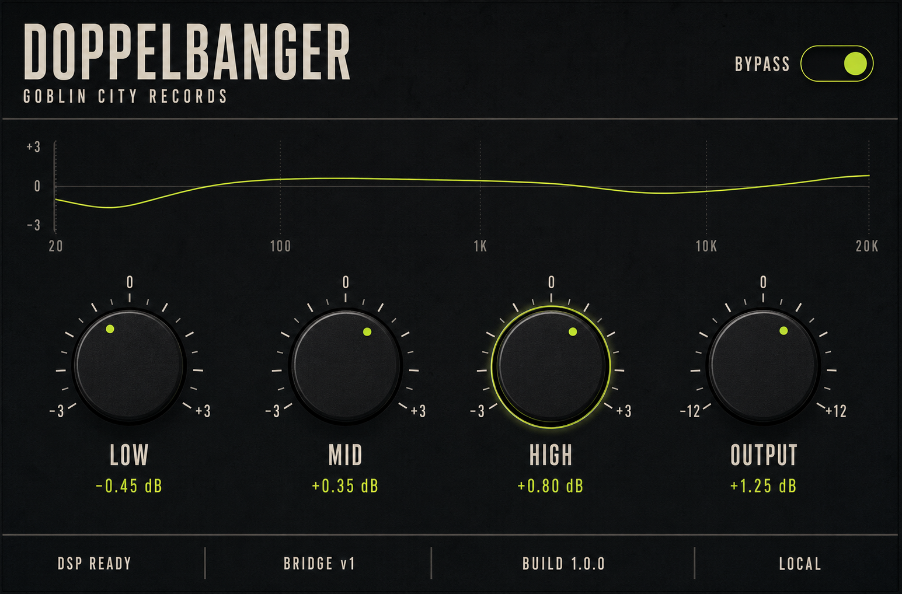

# Windows React Editor Shell Design

**Date:** 2026-08-07

**Status:** Approved under the user's standing implementation approval and explicit React/Windows-only V1 decisions

## Goal

Turn the validated headless Windows VST3 into the first real Doppelbanger
product surface without changing its Rust DSP, VST3 class IDs, automatable
parameter IDs, saved-state compatibility, or native end-user runtime shape.

The result is a compact React and TypeScript editor that opens in Ableton,
controls the existing low, mid, high, output, and host-bypass values, mirrors
host automation, and ships entirely inside the VST3 bundle.

## V1 Boundary

- Windows 10/11 x64 and VST3 are the only release targets in this milestone.
- macOS is deferred and is not named as a V1 promise or acceptance gate.
- Postgres, PostgREST, capture, reference selection, analysis, reports, accounts,
  cloud services, and a standalone browser app are not part of this shell.
- React, Node, and Vite are build-time tools only. End users do not install
  Node, Rust, CMake, PowerShell, WSL, Docker, or a development server.
- The installed plug-in remains native Windows code and uses the Microsoft
  WebView2 Evergreen Runtime for its editor.
- The public distributor is **Goblin City Records**. The existing
  `PLUG_MFR_ID`, `PLUG_UNIQUE_ID`, processor UID, controller UID, and VST3 class
  ID remain unchanged so existing Ableton Sets keep resolving the same device.

## Visual Source Of Truth

The concept defines the layout and visual system, not raster UI assets. The
implementation uses code-native React, CSS, and a small inline SVG curve.

Exact visible copy in the initial viewport is:

- `DOPPELBANGER`
- `GOBLIN CITY RECORDS`
- `BYPASS`
- `LOW`, `MID`, `HIGH`, and `OUTPUT`
- formatted dB values for each rotary control
- `DSP READY`, `BRIDGE v1`, `BUILD 1.0.0`, and `LOCAL`

The surface is fixed at a 760 by 500 logical-pixel design size and scales with
the host/WebView DPI. It uses charcoal black, warm off-white text, a single
acid-chartreuse accent, condensed system-font fallbacks, hairline separators,
four large controls, one bypass switch, and one restrained response curve.
There are no cards, menus, presets, fake meters, decorative badges, remote
images, or cartoon/fantasy branding.

The response curve is an illustrative view of the three current EQ gain
values. It is not an analyzer, a DSP transfer-function claim, or quality
evidence.

## Native Editor Architecture

The plug-in switches from `NO_IGRAPHICS`/headless mode to iPlug2's
`WebViewEditorDelegate`. It keeps the existing single-component VST3 and Rust
processor. The editor delegate:

1. resolves `Contents/Resources/web/index.html` relative to the loaded VST3
   module;
2. opens that exact local file through WebView2's virtual-host mapping;
3. disables developer tools and context menus in Release;
4. rejects navigation outside the mapped local origin;
5. sends controller-thread snapshots and parameter changes to React; and
6. validates bounded editor messages before invoking host gestures.

The WebView2 loader is linked statically into `Doppelbanger.vst3`. Its pinned
SDK and WIL headers are build dependencies only. The WebView2 Evergreen Runtime
is the sole editor runtime dependency and is checked by installer/smoke work;
if it is unavailable, audio and Ableton's generic parameter surface continue
to work.

No JavaScript, JSON parsing, allocation, WebView call, file access, lock, or
wait is added to the audio callback. Editor destruction releases editor-only
state and does not destroy or replace the Rust processor.

## Packaged Frontend

`plugin/ui` contains a pinned React, TypeScript, Vite, Vitest, and Testing
Library project. Vite emits relative asset URLs and a deterministic production
tree. CMake builds that tree with native Windows Node/npm, then copies only the
reviewed production files into `Doppelbanger.vst3/Contents/Resources/web`.

The production `index.html` carries a restrictive Content Security Policy:

- scripts, styles, images, and fonts load only from the packaged origin;
- `connect-src`, frames, objects, media, workers, and external navigation are
  disabled unless a later approved feature requires one;
- there are no remote fonts, analytics, source maps, development sockets, or
  absolute machine paths.

The source dependency directory and transient Vite output do not enter the
VST3 or end-user installer.

## Bridge Version 1

Native and React communicate through a closed version-1 envelope containing
`version`, `type`, optional `request_id`, and a message-specific `payload`.
Incoming messages are rejected before dispatch when they exceed 4096 UTF-8
bytes, are not a JSON object, use an unknown version/type/key, contain a
non-finite number, or violate parameter/value bounds.

React-to-native messages are:

- `ui.ready`
- `parameter.begin_edit`
- `parameter.set`
- `parameter.end_edit`
- `bypass.begin_edit`
- `bypass.set`
- `bypass.end_edit`

Native-to-React messages are:

- `state.snapshot`
- `parameter.changed`
- `bypass.changed`
- `compatibility.error`

The four existing user parameters retain IDs `0` through `3`. Bypass uses
iPlug2/VST3's existing host-bypass parameter and is not inserted into the user
parameter array. A `state.snapshot` contains the four normalized and display
values, authoritative bypass state, bridge version, plug-in build version,
processor readiness, and the local runtime mode.

React never stores an authoritative saved copy. Pointer and keyboard gestures
emit begin/set/end in order; host automation and restored state flow back as
authoritative native updates. Closing and reopening the editor requests a new
complete snapshot.

## Failure Behavior

- Missing WebView2 Runtime or editor construction failure: the editor fails
  visibly where the host permits, while processing and generic parameters stay
  available.
- Missing, extra, or altered production asset: the packaged-asset gate fails;
  the release is not installed.
- Malformed or incompatible bridge message: native rejects it with a stable
  compatibility error and does not change a parameter or audio state.
- Editor close during a gesture: native terminates any open host gesture before
  releasing editor state.
- VST3 state or processor failure behavior remains exactly as in the validated
  headless milestone.

## Verification Gates

Automated gates:

- React unit/component tests cover snapshots, pointer and keyboard gestures,
  host updates, bypass, formatting, compatibility errors, and recreation.
- Native bridge tests share committed valid/invalid fixtures with the frontend
  and prove closed parsing, bounds, and no dispatch on rejection.
- Asset tests require the exact local production tree, relative references,
  CSP, no source maps, no remote URL, and no machine-specific path.
- Native Windows configure/build/CTest and Steinberg Validator remain green.
- The built bundle retains the existing VST3 class ID and reports Goblin City
  Records as vendor.
- A browser render at 760 by 500 is compared directly with the approved concept
  for copy, layout, typography, palette, controls, separators, and status strip.

Manual Ableton gate:

- install the reviewed one-module VST3 bundle;
- scan and insert it in Ableton Live;
- open, close, and reopen the editor repeatedly;
- move every control and verify Ableton automation records and plays it back;
- toggle host bypass from both Ableton and React;
- save, close, and reopen a Set and verify values, audio, and editor snapshot;
- verify audio continues when the editor is closed;
- capture screen and system audio for the public demo.

## Deferred Work

Reference capture, analysis services, Postgres/PostgREST, report generation,
installer-driven WebView2 acquisition, code signing, macOS, and richer mastering
controls require separate approval and evidence. This shell establishes the
final editor host, resource, bridge, automation, and visual foundations so
those workflows do not require replacing the UI stack.
